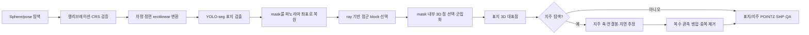

# MMS 도로표지·지주 3차원 좌표 생성

MMS 파노라마에서 YOLO-seg로 도로표지를 찾고, 같은 좌표계의 LAS/PCDB 점군을 영상에 투영해 표지의 3차원 대표점을 계산하는 파이프라인입니다. 선택적으로 표지에 연결된 단일 지주 축을 찾고 로컬 지면까지 연장해 지주 중앙 하단점도 생성합니다.

최종 결과는 표지와 지주를 분리한 `POINTZ` Shapefile입니다. 동일 표지의 반복 관측은 병합하고, 한 지주에 서로 다른 표지가 여러 개 달린 경우에는 각 표지의 `det_id`에 대응하도록 같은 지주 좌표를 반복 기록합니다.

> 이 결과는 자동 후보입니다. 특히 지주 하단이 차량·적재물·식생에 가려진 경우와 점군 분류가 불완전한 구간은 `pole_debug`와 `status`, `obs_count`, RMSE 필드를 검수한 뒤 납품해야 합니다. 최종 측량 정확도는 독립 검사점으로 확인해야 합니다.

## 주요 기능

- 상위 데이터 폴더 아래의 Leica Pegasus Sphere, TRK700 Neo 표준 납품본, 기존 MMS 구조 재귀 자동 탐색
- 차량 진행 방향 중심의 정사각 rectilinear 영상으로 파노라마 왜곡을 줄인 YOLO-seg 추론
- YAML 한 파일로 모델 confidence, 시야각, 거리, 점군, 지주, 디버그, 병렬 실행 설정
- segmentation mask와 보정된 카메라 자세를 이용한 2D 검출 → 3D 점군 역매칭
- 전면 표면 깊이 선택과 밀도 군집화로 배경점 혼입 억제
- 직접 지주와 수평 연결봉이 확인된 원격 지주 탐색
- 지주 하단 가림 시 관측 축과 로컬 지면 평면의 교점 계산
- 표지·지주 분리 `POINTZ` SHP, CRS sidecar, JSON, QA 이미지, LAS crop 생성
- 콘솔 상태바/처리율/ETA 표시와 전체 파일 로그 저장
- Windows/Linux 공용 가상환경 자동 구성 및 PyTorch/CUDA smoke test
- 서버 폴더·재개 가능한 업로드, 작업 구간, 수치 입력/자동 설정을 묶은 웹 작업실
- VWorld WebGL 3.0 지도, 360° 파노라마, 점 예산 기반 3D 점군의 동기화된 검수 화면

수집업체에 전달할 입력 데이터 요구사항은 [docs/MMS_DATA_SPEC.md](docs/MMS_DATA_SPEC.md)에 정리되어 있습니다. 환경 구성 세부사항은 [ENV_SETUP.md](ENV_SETUP.md)를 참고하십시오. 현재 실행 흐름과 개선 상태는 [현재 아키텍처](docs/current_architecture.md)와 [아키텍처 개선 보고서](docs/ARCHITECTURE_IMPROVEMENT_REPORT.md)에서 확인할 수 있습니다.

## 저장소 구성

| 경로 | 역할 |
|---|---|
| `scripts/run_pipeline.py` | YAML 설정으로 전체 파이프라인 실행 |
| `config.yaml` | 기본 실행 설정과 모든 옵션의 한국어 설명 |
| `models/*.pt` | 자동 발견되는 YOLO detection/segmentation 가중치 |
| `scripts/extract_calibration.py` | Pegasus DB에서 카메라·LiDAR 보정 snapshot 추출 |
| `scripts/export_calibration_values.py` | 보정 snapshot에서 숫자·단위만 JSON/CSV로 내보내기 |
| `calibration_values.yaml` | 값 전용 보정 내보내기 입력·출력 설정 |
| `scripts/setup.ps1`, `scripts/setup.sh` | OS별 Python 3.12 자동 탐색과 환경 구성 시작 |
| `scripts/setup_web.ps1`, `scripts/setup_web.sh` | Python 의존성 설치와 웹 UI 패키지 설치·빌드 |
| `scripts/run_web.py` | FastAPI API와 빌드된 웹 작업실 실행 |
| `scripts/bootstrap_environment.py` | `.venv` 생성, 고정 패키지 설치, GPU/CUDA 사전 검사 |
| `scripts/verify_environment.py` | PyTorch/CUDA/NMS/주요 패키지 smoke test |
| `mms_shp_detection/` | 데이터 탐색, 투영, 점군, 지주, SHP 구현 |
| `mms_shp_detection/webapp/` | 데이터 등록·preview·업로드·GPU 작업 큐 API |
| `webui/` | React/VWorld WebGL 3.0/Three.js 작업자 UI |
| `tests/` | 설정·투영·점군·지주·SHP 회귀 테스트 |
| `docs/MMS_DATA_SPEC.md` | MMS 수집업체 전달용 데이터 명세 |
| `docs/WEB_UI_ARCHITECTURE.md` | 대용량 로딩, 서버 배치, 보안·운영 설계 |
| `docs/current_architecture.md` | CLI·웹·worker의 현재 호출 흐름과 데이터 계약 |
| `docs/ARCHITECTURE_IMPROVEMENT_REPORT.md` | 구현 범위, 호환성, 검증 결과와 후속 로드맵 |

## 웹 작업실 빠른 시작

웹용 setup은 기존 Python/CUDA 환경을 구성한 뒤 잠긴 npm 패키지를 설치하고 배포용
정적 UI까지 빌드합니다.

Windows PowerShell:

```powershell
powershell -ExecutionPolicy Bypass -File .\scripts\setup_web.ps1
.\.venv\Scripts\python.exe .\scripts\run_web.py
```

Linux:

```bash
bash scripts/setup_web.sh
./.venv/bin/python scripts/run_web.py
```

설치 후 브라우저에서 `http://127.0.0.1:8000`을 엽니다. 설치 예정 항목만 확인할 때는
기존과 동일하게 `--dry-run`을 전달합니다.

```powershell
powershell -ExecutionPolicy Bypass -File .\scripts\setup_web.ps1 --dry-run
```

기본 저장소는 프로젝트의 `data` 폴더입니다. 서버/NAS 폴더를 노출할 때는 허용할
루트만 반복 지정하며, UI와 API에는 이 루트 바깥의 절대경로가 공개되지 않습니다.

```powershell
.\.venv\Scripts\python.exe .\scripts\run_web.py `
  --storage-root D:\MMS\incoming `
  --storage-root \\nas\MMS\archive
```

지도는 same-origin iframe에서 VWorld WebGL 3.0 SDK를 로드하며
외부 지도 style URL 설정을 사용하지 않습니다. SDK 인증키는
브라우저 loader 요청에 포함되는 클라이언트 값이며, VWorld에 등록된
origin에서 사용해야 합니다. 허용 저장소는 운영체제의 경로 구분자로 나눈
`MMS_WEB_STORAGE_ROOTS` 환경변수로 설정할 수 있습니다. 이 앱에는 자체 로그인
기능이 없으므로 기본 실행기는 loopback 주소만 허용합니다. 외부 접속 운영 시에는
API를 `127.0.0.1`에 유지하고, TLS와 사용자 인증을 적용한 reverse proxy만 외부에
노출하십시오. 방화벽과 인증 proxy로 포트 접근을 이미 제한한 별도 컨테이너 구성에서만
위험을 이해하고 `--allow-remote-bind`를 사용하십시오.

GPU 작업 큐와 재시작 복구의 단일 소유권을 보장하기 위해 하나의 `--state-dir`에는
ASGI worker를 1개만 실행합니다. 같은 상태 폴더를 쓰는 두 번째 worker는 시작 단계의
OS lock에서 거부됩니다. 수평 확장은 API/worker와 상태 저장소를 분리하는 후속 서버
구성에서 진행하십시오.

서버 재시작 시 아직 child를 만들지 않은 `preparing` 실행만 다시 queue에 넣습니다.
이미 spawn됐을 수 있는 `starting`/`running`/`cancelling` 실행은 중복 실행을 막기 위해
manifest와 terminal 상태를 조정합니다. 완료 stage부터 이어가는 checkpoint resume는
없습니다. 또한 저장된 PID의 프로세스 identity를 안전하게 확인할 정보가 아직 없으므로,
비정상 종료 뒤 남은 child는 운영자가 확인·종료해야 합니다.

웹이 생성한 `config.yaml`은 정확한 파일 SHA-256으로 pending manifest에 고정되며,
자식 파이프라인이 같은 파일을 읽었을 때만 실행을 이어갑니다. 실행 성공은 exit code만이
아니라 stage가 모순되지 않는 `succeeded` manifest, 현재 실행이 선언한 완전한 SHP
bundle, 다중 모델일 때 완료 상태와 SHP 목록이 일치하는 `models_manifest.json`까지
검증한 뒤 공개됩니다.

등록을 마친 원본 폴더는 scan·preview·pipeline 실행 중에는 변경하지 말고, 운영
서버에서는 가능하면 API/worker에 읽기 전용으로 mount하십시오. 새 업로드는 incoming
영역에서 완료·검증한 뒤 등록 폴더로 이동하는 흐름을 사용합니다. 공유 NAS를 쓸 때도
등록 root의 rename/write 권한을 비신뢰 사용자나 별도 프로세스와 동시에 공유하지
마십시오.

작업 순서는 다음과 같습니다.

1. 허용된 서버 저장소에서 MMS 폴더를 등록하거나 폴더를 chunk 단위로 업로드합니다.
2. Survey/Track과 프레임 구간을 지도에서 확인하고, 시작·끝 번호 입력 또는
   현재 프레임 기준 지정/`Shift+클릭`으로 작업 범위를 선택합니다.
3. 자주 쓰는 값을 직접 넣는 **수치 입력** 또는 장비 사양과 선택한 자원 프로필로
   worker·batch를 정하는 **자동 설정**을 선택합니다.
4. 실행 큐에서 준비·실행·완료 상태와 로그를 확인합니다.
5. 지도 위에서 360° 파노라마와 3D 점군 오버레이를 필요한 것만 켜고 결과를 검수합니다.

초기 화면은 경로와 요약만 받고, 파노라마와 점군은 오버레이를 켰을 때 축소본과 제한된
점 예산으로 지연 로딩합니다. 파노라마는 빠름(최대 2K), 기본 고화질(4K), 선택형
최고화질(8K) 파생본을 서버 캐시로 재사용합니다. LAS 전체는 브라우저로 직접 전송하지
않습니다. 파노라마 포인트 옵션을 켜면 서버가 선택 프레임 주변 점만 360° UV로 투영하고
화면 셀별 최근점 최대 3만 개로 줄여 전송합니다. UI에서 오버레이 투명도를 조절할 수
있습니다.

지도와 왼쪽 트랙 표시는 최대 12개 트랙까지 서로 다른 색을 공유하되 지도에는 기본적으로
현재 활성 트랙만 표시합니다. 일반 설정에서 전체 트랙 표시로 전환할 수 있고 선택한 실행
범위는 지도에서 흰색 테두리로 강조됩니다. `←`/`A`, `→`/`D`로 이전·다음 프레임을
이동할 수 있고 파노라마 좌우 이동 영역을 클릭해도 같은 방식으로 이동합니다. 프레임을
바꾸면 파노라마는 영상 기준 정면으로 돌아오며 일반 설정의 보정각으로 장비별 장착 오차를
조정할 수 있습니다. 데이터 탐색기, 프레임/구간, 공간 뷰어, 파노라마, 3D 점군, 작업
설정, 일반 설정의 새 창 아이콘을 누르면 해당 컴포넌트를 두 번째 모니터로 분리할 수 있고
상태는 기본 창과 계속 동기화됩니다. 작업 목록의 제거 버튼은 서버 원본 폴더를 삭제하지
않고 등록과 파생 프레임 인덱스만 해제합니다.
대용량 운영 구조와 향후 NAS/object storage 배치 방법은
[웹 작업실 아키텍처](docs/WEB_UI_ARCHITECTURE.md)를 참고하십시오.

## 지원 입력

### Leica Pegasus 프로젝트

`paths.data_root` 아래에서 다음 파일을 재귀 탐색합니다.

```text
<data_root>/
  MultiJob.PegasusProject/
    Export/
      JPEG/<Job>/<Track>/Sphere/
        *_Sphere.csv          # 프레임별 위치·자세
        *_Sphere.txt          # equirectangular 크기/범위 sidecar
        *_Sphere_*.jpg        # 360° Sphere 영상
      LAS/
        <Job>_<Track>.las     # 전체본 또는 검증 가능한 _1, _2, ... 분할본
    <Job>.job/
      job.db                  # GPS week, LiDAR-to-IMU 보정
      <Track>.scan/scan.db    # 카메라 내부·외부 보정
```

현재 Sphere CSV는 세미콜론 구분, 무헤더 17열 형식입니다.

```text
JPEG;GPS_SOW;X;Y;Z;omega_gon;phi_gon;kappa_gon;R11;...;R33
```

3×3 행렬은 local panorama → world 회전이며 코드에서는 다음 축으로 해석합니다.

```text
right   = R[:, 0]
up      = R[:, 1]
forward = -R[:, 2]
```

Leica가 Front/Rear 물리 카메라의 EUCM 내부표정과 보어사이트를 적용해 7040×3520 equirectangular Sphere를 생성하므로, 파이프라인은 raw 카메라 보정값을 Sphere에 다시 적용하지 않습니다. `calibration.json`은 센서·출력 크기·GPS week·보정 provenance를 검증하는 데 사용하고, 프레임 위치와 자세는 `*_Sphere.csv`를 사용합니다.

LAS 전체본과 `_1`, `_2`, … 분할본이 함께 있으면 분할 번호의 연속성, 점 수 합계, bounds, CRS, scale, point format을 검사합니다. 분할본이 완전할 때만 분할본을 사용하며, 불완전하면 전체본을 선택합니다. 영상 Job과 관계없는 LAS는 인덱싱 대상에서 제외됩니다.

### Leica 표준 납품 폴더(TRK700 Neo 포함)

국토지리정보원 MMS 설정 INI가 포함된 다음 구조도 재귀 탐색합니다. Camera01~04의 일반 영상은 제외하고, Sphere 메타데이터가 있는 카메라만 처리합니다.

```text
<data_root>/<delivery>/<survey>/<TRACK>/
  MMS_Leica_<Model>_<Serial>.ini
  Camera05/
    External Orientation.csv
    Internal Orientation.txt
    *Sphere*.jpg
  Laser01/
    *.las
  <TRACK>_Trajectory.prj
```

`External Orientation.csv`의 17열 위치·자세와 `Internal Orientation.txt`의 7040×3520 Sphere 정보를 사용합니다. INI의 제조사·모델·시리얼과 Sphere 내부표정 파일은 해당 트랙의 보정 provenance로 검증합니다. LAS 헤더에 CRS가 없으면 같은 트랙에서 가장 가까운 단일 `.prj`를 사용하며, 여러 서로 다른 PRJ가 있어 모호하면 자동 선택하지 않습니다.

### 기존 MMS

기존 구조도 유지됩니다.

```text
<data_root>/
  CAM/**/*.csv
  CAM/**/*.{jpg,jpeg,png,tif,tiff}
  LAS/**/*.pcdb
```

```yaml
input:
  pose_format: legacy
  point_source: pcdb
```

`pose_format: auto`는 상위 폴더 전체에서 legacy CAM, Leica `*_Sphere.csv`, 표준 납품 `External Orientation.csv`를 함께 찾습니다. `point_source: auto`도 서로 독립된 PCDB와 LAS 납품본이 같이 있으면 둘 다 카탈로그에 넣고, 작업/트랙 경로와 공간 범위로 해당 점군만 매칭합니다. 특정 형식만 처리하려면 `legacy`, `leica-sphere`, `leica-delivery` 또는 `pcdb`, `las`를 명시하십시오.

## 빠른 시작

### 1. 기본 파일 경로 확인

[config.yaml](config.yaml)의 다음 값을 먼저 실제 데이터에 맞춥니다. 상대경로는 터미널의 현재 위치가 아니라 YAML 파일이 있는 폴더 기준입니다.

```yaml
paths:
  data_root: data
  calibration_path: calibration.json
  model_path: null
  model_dir: models
  output_dir: outputs_Neo700_models
```

`model_dir` 바로 아래의 모든 `.pt`를 파일명 순으로 선택합니다. 기본 설정은 모델별 추론을 병렬 실행하며, `execution.multi_model_parallel: false`로 바꾸면 같은 목록을 순차 실행합니다. 두 모드 모두 각 모델은 `model_filters`에 파일명 또는 stem과 정확히 일치하는 프로필이 있어야 하므로, 표지판과 신호등의 거리·점군·지주 필터가 섞이지 않습니다. 모델 SHA-256이 실행 fingerprint에 포함되므로 모델을 교체하면 `skip_existing: true`여도 해당 모델 결과를 다시 처리합니다.

명시적으로 전달한 CLI 필터는 해당 모델 프로필보다 우선합니다. 예를 들어 `--max-range-m 18`은 발견된 모든 모델의 프로필 값보다 우선하므로, 모델별 기본값을 유지하려면 별도 CLI override 없이 실행하십시오. strict/fallback 거리처럼 서로 제약되는 값은 두 옵션을 함께 조정해야 합니다.

### 2. 가상환경 자동 구성

x86-64 Windows 또는 Linux와 64-bit CPython 3.12가 필요합니다. OS별 setup launcher는 현재 터미널에서 사용 가능한 Python 명령을 순서대로 검사합니다. 이어서 bootstrap이 운영체제와 CPU architecture, Python, `nvidia-smi`, driver가 지원하는 CUDA 버전과 GPU compute capability를 확인하고 `cu128`, `cu126`, `cu118` 중 가장 높은 호환 PyTorch wheel을 자동으로 선택한 뒤 프로젝트 전용 `.venv`를 만들거나 재사용합니다. 활성화된 가상환경이나 전역 `pip`는 사용하지 않습니다.

Windows PowerShell:

```powershell
Set-Location C:\work\mms_project
powershell -ExecutionPolicy Bypass -File .\scripts\setup.ps1
```

Linux:

```bash
cd /path/to/mms_project
bash scripts/setup.sh
```

launcher는 Python이나 운영체제 패키지를 임의로 설치하지 않습니다. 64-bit CPython 3.12를 찾지 못하면 설치와 터미널 재실행이 필요하다는 오류를 출력합니다. Linux에서 `venv`가 별도 패키지인 배포판은 Python 3.12용 venv 패키지도 준비해야 합니다.

파일이나 패키지를 변경하지 않고 탐지 결과와 설치 예정 명령만 확인하려면 인자를 그대로 전달합니다.

```powershell
powershell -ExecutionPolicy Bypass -File .\scripts\setup.ps1 --dry-run
```

```bash
bash scripts/setup.sh --dry-run
```

GPU가 없거나 지원 CUDA 범위가 너무 낮은 장비에서 CPU 실행을 의도한 경우에만 `--allow-cpu`를 명시합니다. 이때 bootstrap은 CUDA wheel 대신 공식 CPU wheel을 선택합니다.

```bash
bash scripts/setup.sh --allow-cpu
```

launcher를 사용하지 않고 bootstrap을 직접 실행할 수도 있습니다. 호출한 Python이 3.12가 아니더라도 bootstrap은 같은 터미널의 `py -3.12`, `python3.12`, `python3`, `python` 등을 검색해 올바른 interpreter를 선택합니다.

```powershell
py .\scripts\bootstrap_environment.py
```

```bash
python3 scripts/bootstrap_environment.py
```

기존 `.venv`가 손상됐거나 Python 3.12가 아니면 bootstrap은 자동 삭제하지 않고 중단합니다. 필요한 파일을 보존한 뒤 해당 폴더를 직접 다른 이름으로 이동하고 다시 실행하십시오.

#### CUDA/PyTorch 버전 원칙

bootstrap은 framework의 기본 버전을 다음과 같이 고정하고, CUDA runtime은 시스템에 맞게 선택합니다.

```text
torch       2.7.1
torchvision 0.22.1
torchaudio  2.7.1
```

| `nvidia-smi`의 driver 지원 CUDA | 자동 선택 wheel | wheel 내장 runtime |
|---|---|---|
| 12.8 이상 | `cu128` | CUDA 12.8 |
| 12.6 이상, 12.8 미만 | `cu126` | CUDA 12.6 |
| 11.8 이상, 12.6 미만 | `cu118` | CUDA 11.8 |
| 11.8 미만 또는 NVIDIA GPU 미탐지 | 기본 실패, `--allow-cpu`일 때 `cpu` | 없음 |

`nvidia-smi`의 `CUDA Version`은 설치된 Toolkit 버전이 아니라 NVIDIA driver가 지원하는 최대 CUDA 버전입니다. PyTorch wheel은 필요한 CUDA runtime을 자체 포함하므로 일반 설치에서는 시스템 CUDA Toolkit이나 `nvcc` 버전과 일치시킬 필요가 없습니다. bootstrap은 driver 호환성과 실제 CUDA tensor/NMS 실행을 함께 확인합니다.

재현이나 문제 분석을 위해 wheel을 명시하려면 `--torch-runtime`을 사용합니다. 선택한 CUDA runtime을 driver가 지원하지 않으면 패키지를 설치하기 전에 실패하며 자동으로 하위 버전으로 바꾸지 않습니다.

```powershell
powershell -ExecutionPolicy Bypass -File .\scripts\setup.ps1 --torch-runtime cu126
```

CPU wheel을 무조건 선택하려면 다음처럼 명시할 수 있습니다.

```bash
bash scripts/setup.sh --torch-runtime cpu
```

설치 후 검증:

```powershell
.\.venv\Scripts\python.exe .\scripts\verify_environment.py
.\.venv\Scripts\python.exe -m pip check
```

Linux:

```bash
./.venv/bin/python scripts/verify_environment.py
./.venv/bin/python -m pip check
```

예를 들어 driver가 CUDA 12.8 이상을 지원하는 GPU 환경의 핵심 정상 출력은 다음과 같습니다.

```text
torch=2.7.1+cu128
torchvision=0.22.1+cu128
torchaudio=2.7.1+cu128
torch_cuda_runtime=12.8
cuda_available=True
cuda_nms=[0]
environment_check=OK
```

선택 결과는 driver에 따라 `cu126`이나 `cu118`이 될 수 있습니다. 장비명이나 특정 runtime 문자열보다 마지막 `environment_check=OK`와 종료 코드 0을 정상 기준으로 사용하십시오.

### 3. 캘리브레이션 추출

Pegasus 프로젝트의 `Track*.scan/scan.db`와 각 Job의 `job.db`에서 보정 snapshot을 만듭니다.

```powershell
.\.venv\Scripts\python.exe .\scripts\extract_calibration.py `
  .\TRK500Neo\MultiJob.PegasusProject `
  --output .\calibration.json
```

Linux:

```bash
./.venv/bin/python scripts/extract_calibration.py \
  ./TRK500Neo/MultiJob.PegasusProject \
  --output ./calibration.json
```

추출 파일에는 Sphere 출력 모델/크기, Front/Rear EUCM `fx/fy/cx/cy/alpha/beta`, distortion, internal/external boresight, LiDAR-to-IMU Distance/Angles/Mounting, GPS week와 원본 값 provenance가 들어갑니다. Leica 내부 DB의 일부 값은 단위 메타데이터 없이 저장되므로 공급업체가 frame·축 순서·회전 정의·단위를 명시한 권위 보정 파일을 함께 제공하는 것이 가장 안전합니다.

#### 숫자와 단위만 별도 추출

검토표나 외부 문서에 넣을 값만 필요하면 `calibration_values.yaml`을 확인한 뒤 다음 명령을 실행합니다.

```powershell
.\.venv\Scripts\python.exe .\scripts\export_calibration_values.py
```

```bash
./.venv/bin/python scripts/export_calibration_values.py
```

기본 설정은 기존 `calibration.json`을 읽어 다음 두 파일을 만듭니다.

```text
calibration_values.json  # 센서/항목 계층과 단위를 유지한 읽기 쉬운 값 파일
calibration_values.csv   # 값 하나당 한 행인 Excel 검토용 UTF-8 BOM CSV
```

내보내는 항목은 Sphere 크기/투영 모델, 카메라 EUCM·왜곡·내외부 boresight, LiDAR→IMU 보정, GPS week, 좌표계 EPSG/축/타원체/투영 파라미터입니다. base64, hex, 전체 WKT와 원본 DB 경로는 제외합니다. Leica DB가 단위를 선언하지 않은 카메라 boresight 값은 임의 단위를 붙이지 않고 `not_declared_in_leica_db`로 표시합니다.

입력은 `calibration.json` 또는 PegasusProject 디렉터리를 사용할 수 있습니다. JSON을 입력하면서 `project.db`의 좌표계 값도 포함하려면 `input.project_root`를 함께 지정합니다. 다른 설정은 YAML 경로 하나만 전달합니다.

```powershell
.\.venv\Scripts\python.exe .\scripts\export_calibration_values.py .\my_calibration_values.yaml
```

CSV가 필요 없으면 YAML의 `output.csv_path`를 `null`로 둡니다. 이 값 전용 파일은 검토/전달 편의를 위한 것이며, 파이프라인의 보정 provenance 검증에는 원본 구조를 보존한 `calibration.json`을 계속 사용합니다.

### 4. YAML 기반 실행

기본 실행에는 인자를 사용하지 않습니다. 저장소 루트의 `config.yaml`을 자동으로 읽습니다.

```powershell
.\.venv\Scripts\python.exe .\scripts\run_pipeline.py
```

```bash
./.venv/bin/python scripts/run_pipeline.py
```

별도 설정 파일을 사용할 때만 YAML 경로 하나를 전달합니다.

```powershell
.\.venv\Scripts\python.exe .\scripts\run_pipeline.py .\config_verify.yaml
```

한 프레임만 검증할 때는 `config.yaml`을 복사한 별도 YAML에서 다음처럼 범위를 제한하십시오.

```yaml
paths:
  output_dir: outputs_verify

resume_and_scope:
  skip_existing: false
  start_index: 175   # 정렬된 전체 프레임의 0 기반 인덱스
  limit_images: 1
```

## YAML 설정

모든 항목의 의미, 단위, 조정 방향은 [config.yaml](config.yaml)의 항목 바로 위에 한국어 주석으로 적혀 있습니다. 일반적으로 먼저 조정하는 값은 다음과 같습니다.

| 키 | 현재 예시값 | 용도/조정 기준 |
|---|---:|---|
| `paths.model_dir` | `models` | 폴더 바로 아래의 모든 `.pt`를 자동 실행 |
| `model_filters.<model>` | 모델별 설정 | 모델마다 `object_type`, 점군, 지주 필터를 독립 적용 |
| `yolo.imgsz` | `1280` | 작은 표지 누락 시 GPU 메모리를 확인하며 증가 |
| `yolo.conf` | `0.8` | 누락이 많으면 낮추고 오검출이 많으면 높임 |
| `panorama_detection.detection_view_mode` | `forward` | 전방 표지는 왜곡을 편 정면 view 권장 |
| `forward_view_hfov_deg`, `forward_view_vfov_deg` | `70`, `70` | 정사각 입력에서 두 값을 같게 유지해 비율 왜곡 방지 |
| `point_matching.max_center_ray_angle_deg` | `45` | 최종 좌표로 채택할 차량 전방 중심각 |
| `point_matching.max_range_m` | `15` | 카메라에서 점까지 허용하는 기본 최대 거리 |
| `point_matching.point_range_fallback_enabled` | `true` | strict 범위의 mask 점이 0개일 때만 제한적 거리 재탐색 |
| `point_matching.point_range_fallback_max_range_m` | `20` | no-points 재탐색 최대 거리; 일반 탐색 거리에는 영향 없음 |
| `point_matching.point_range_fallback_min_point_count` | `50` | 품질 gate를 모두 통과한 fallback 단일 군집의 최소점 |
| `point_matching.point_range_fallback_min_cluster_fraction` | `0.80` | 전방 깊이점 중 선택 단일 군집이 차지해야 하는 최소 비율 |
| `point_matching.point_range_fallback_min_core_mask_fraction` | `0.45` | fallback 군집 중 원본 비팽창 mask 내부 점의 최소 비율 |
| `point_matching.point_range_fallback_max_depth_span_m` | `0.50` | fallback 군집 거리의 5~95% 분위수 폭 최대값 |
| `point_matching.min_point_count` | `100` | 이보다 점이 적은 검출은 SHP에서 제외 |
| `pole_detection.pole_detection` | `true` | 지주 탐색 전체 기능 on/off |
| `pole_classification_mode` | `off` | LAS class 자동 사용(`auto`), 완전 무시(`off`), 필수 검증(`require`) |
| `pole_direct_max_axis_sign_distance_m` | `0.75` | 표지에 직접 붙은 지주의 최대 수평 연관 거리 |
| `pole_max_axis_sign_distance_m` | `8.0` | 수평 암 검증을 거치는 원격 지주의 최대 거리 |
| `pole_range_fallback_enabled` | `true` | strict 지주 실패 시 더 넓은 물리 XY/Z 범위로 한 번 재탐색 |
| `pole_fallback_search_radius_m`, `pole_fallback_max_drop_m` | `10`, `12` | 8m 초과 지주용 2차 탐색 반경과 하강 높이 |
| `pole_min_horizontal_connection_coverage` | `0.50` | 원격 지주까지 실제 연결봉이 채운 구간 비율 |
| `pole_horizontal_connection_coherence_radius_m` | `0.10` | 표지와 지주 양 끝을 잇는 단일 3D 중심선 주변으로 인정할 연결봉 반경 |
| `pole_min_horizontal_connection_coherent_ratio` | `0.65` | raw coverage 중 같은 3D 중심선으로 설명되어야 하는 최소 비율 |
| `pole_min_horizontal_connection_coherent_point_fraction` | `0.30` | 연결 구간 내부 점 중 일관된 3D 중심선을 지지해야 하는 최소 비율 |
| `pole_axis_plumb_full_tilt_deg`, `pole_axis_plumb_max_tilt_deg` | `2`, `4` | 위·아래 지주 점군 중심을 이용해 작은 축 기울기를 수직 보정하는 각도 범위 |
| `pole_axis_plumb_endpoint_fraction` | `0.20` | 위·아래 robust 중심을 계산할 때 각 끝에서 사용하는 지주 Z-bin 비율 |
| `pole_remote_max_endpoint_tilt_deg` | `5.0` | 원격 지주 위·아래 중심이 허용할 최대 축 기울기; 초과하면 비정형 구조로 제외 |
| `pole_long_remote_distance_m` | `8.0` | 원격 지주의 축·연결 근거를 점진적으로 강화하기 시작하는 연관 거리 |
| `pole_long_remote_transition_m` | `2.0` | 장거리 강화 기준이 최종값까지 부드럽게 전환되는 거리 |
| `pole_long_remote_min_vertical_span_m` | `3.5` | 전환 구간 이후 장거리 원격 지주에 요구하는 최소 관측 축 길이 |
| `pole_long_remote_min_completeness_ratio` | `0.85` | 전환 구간 이후 장거리 원격 지주에 요구하는 최소 축 완전도 |
| `pole_long_remote_min_connection_coverage_ratio` | `0.85` | 전환 구간 이후 장거리 원격 지주에 요구하는 최소 coherent 3D 연결 coverage |
| `pole_preferred_min_completeness_ratio` | `0.75` | 짧은 가장자리보다 지면~표지 높이를 충분히 관측한 전체 지주축 우선 |
| `pole_geometry_ground_clearance_m` | `0.20` | class가 없을 때 저점 지면대의 점을 축 후보에서만 제거; `0`이면 해제 |
| `pole_geometry_remote_min_completeness_ratio` | `0.75` | class 없는 원격 지주의 최소 축 완전도 하드 기준 |
| `pole_geometry_remote_max_axis_rmse_m` | `0.095` | class 없는 원격 지주의 최대 축 방사 오차(m) |
| `pole_geometry_remote_max_ground_rmse_m` | `0.15` | class 없는 원격 지주의 최대 지면 평면 오차(m) |
| `pole_require_ground` | `true` | 신뢰 가능한 지면이 없으면 지주 하단점 보류 |
| `pole_max_ground_penetration_m` | `0.10` | 관측 축이 지면 아래로 들어간 것으로 볼 최대 허용 오차; 초과 시 `GROUND_CONFLICT/REVIEW` |
| `pole_max_ground_support_distance_m` | `0.35` | 하단점에서 지면 근거 셀까지의 자동 승인 최대 거리(m) |
| `debug_output.debug_mask_alpha` | `8` | 표지가 보이도록 검출 mask 채움 투명도 조정, 선만 보려면 0 |
| `execution.num_workers` | `1` | CPU는 병렬 가능, 단일 GPU는 실질적으로 1부터 권장 |
| `resume_and_scope.skip_existing` | `true` | fingerprint와 산출물이 모두 일치하는 프레임만 재사용 |

단일 GPU에서 여러 worker가 같은 `cuda:0`을 공유하면 메모리 충돌이 날 수 있습니다. `allow_unsafe_cuda_multiprocessing: false`이면 요청값이 2 이상이어도 런타임이 안전하게 1개 worker로 낮춥니다.

`skip_existing`의 재사용 판단에는 코드, 모델 checksum, calibration checksum, 영상/pose signature, 점군 signature, CRS와 처리 설정이 포함됩니다. 설정 또는 입력이 달라지면 기존 TXT가 있어도 다시 계산합니다. 참조된 crop/debug 파일이 사라진 결과도 재사용하지 않습니다.

## 처리 파이프라인



### 1. 입력·보정·좌표계 검증

1. pose CSV와 Sphere sidecar를 읽고 이미지 존재 여부, 행렬 직교성/행렬식, 영상 크기, 투영 범위를 검사합니다.
2. `calibration.json`을 Job/Track과 매칭하고 Sphere 크기와 GPS week를 교차검증합니다. raw 카메라 보정은 이미 stitched Sphere에 적용됐으므로 다시 곱하지 않습니다.
3. LAS/PCDB 공간 인덱스를 `.cache/pointcloud_catalog.json`에 만듭니다. LAS XYZ는 대규모 northing에서도 정밀도가 줄지 않도록 전 구간 `float64`로 유지합니다.
4. 선택될 점군 파일의 CRS가 의미상 같은지 확인하고, pose 원점과 점군 bbox의 XY 거리가 과도하면 Job/CRS 불일치로 중단합니다.
5. `alignment_qa_enabled: true`이면 여러 프레임의 파노라마 RGB와 LAS RGB 잔차를 측정해 `panorama_alignment_qa.json`에 권고값만 기록합니다. 실행 중 yaw/pitch 설정을 자동 변경하지 않습니다.

### 2. 파노라마 표지 검출

기본 `forward` 모드는 프레임별 차량 진행축을 중심으로 70°×70° 정사각 rectilinear 영상을 렌더링합니다. equirectangular 원본을 그대로 축소할 때 생기는 비율·극점 왜곡을 줄이고, 작은 전방 표지가 YOLO 입력에서 차지하는 픽셀을 보존하기 위한 단계입니다. YOLO에는 표시가 없는 원본 배열을 전달하고, `forward_views`의 QA 복사본에만 중심축과 최종 허용각을 그립니다.

`panorama` 모드는 360° 전체 영상과 겹치는 perspective tile 검출을 지원합니다. 겹치는 결과는 파노라마 seam을 고려한 circular IoU로 병합합니다. 전방 도로표지 작업에는 `forward`를 권장하며, 후방/측방 표지까지 필요할 때만 `panorama`와 tile 옵션을 사용하십시오.

YOLO의 bbox·segmentation polygon은 원본 파노라마 픽셀로 역변환됩니다. 이후 검출 중심 ray가 `max_center_ray_angle_deg`를 넘으면 최종 SHP 대상에서 제외합니다. 0°/360° seam을 가로지르는 polygon과 bbox는 X 좌표를 순환 좌표로 풀어 처리합니다.

### 3. 표지 2D mask → 3D 대표점

각 검출은 다음 순서로 3차원화됩니다.

1. bbox/mask의 각반경과 중심 ray로 교차 가능한 LAS/PCDB spatial block만 선택합니다.
2. 검출 주변을 정사각 perspective view로 다시 펼치고 세계좌표 점들을 해당 view에 투영합니다.
3. segmentation mask가 있으면 mask 내부를, 없으면 bbox와 설정 여백 내부를 선택합니다.
4. strict `max_range_m` 안의 mask 점이 정확히 0개이고 fallback이 켜진 경우에만 더 긴 `point_range_fallback_max_range_m`로 block 선택부터 한 번 다시 수행합니다. strict 범위에서 한 점이라도 얻었다면 기존 결과를 유지하고 fallback을 실행하지 않습니다.
5. 카메라 거리의 낮은 분위수와 최소 지지점으로 robust front-surface anchor를 구합니다. 단일 최근접 잡음점이 전체 깊이 창을 결정하지 않게 한 뒤 `depth_window_m` 이내 점만 남깁니다.
6. 3D 이웃 밀도 군집을 만들고 가까운 유효 군집을 선택한 뒤, 군집 중심에서 과도하게 먼 점을 trim합니다.
7. fallback 결과는 최소점 외에도 단일 군집, 군집 점유율, 대표점의 원본 mask 포함, 원본 mask 지지율, robust 깊이폭을 모두 통과해야 합니다. 단순히 15m 안의 배경 식생점을 가져오지 않기 위한 별도 gate입니다.
8. 최종 군집의 XYZ 중앙값을 표지 대표점으로 사용합니다. 일반 결과는 `min_point_count`, fallback은 별도 최소점과 품질 gate를 적용하며 거리/각도 기준 밖 또는 유효 군집이 없는 검출은 JSON과 QA에 사유를 남기되 SHP에서는 제외합니다.

`point_crops/*.las`는 이 선택 과정을 검수하기 위한 파생 점군입니다. XYZ와 파노라마에서 샘플링한 RGB를 담지만 원본 intensity, classification, GPS time, return, point ID를 보존하는 원본 레코드 crop은 아닙니다.

### 4. 지주 검출과 하단점 계산

`pole_detection.pole_detection: true`일 때만 실행합니다. 현재 구현은 문형식/두 지주의 중앙을 가정하지 않고 표지 detection당 하나의 물리 지주(`SINGLE`)를 찾습니다.

1. **탐색 영역 구성**: 표지 주변을 넓게 rectification하고 bbox 아래·좌우 corridor를 먼저 검색합니다. 직접 지주가 없으면 아래쪽 수직 band를 좌우 전체로 넓혀 원격 지주 후보를 다시 찾습니다.
2. **class 정책과 필터**: 기본값 `pole_classification_mode: auto`는 YAML의 ground(`2`, `11`), excluded vegetation(`3`, `4`, `5`), 공급사 확인 pole ID 중 하나가 선택 LAS에 실제로 있을 때만 class와 형상을 함께 쓰는 `HYBRID` 모드가 됩니다. LAS가 전부 미분류 `0/1`이거나 매핑되지 않은 custom ID만 있으면 자동으로 `GEOMETRY`가 되어 class 필터와 분류 지면을 사용하지 않습니다. `off`는 class가 있어도 강제로 완전히 무시하고, `require`는 선택된 모든 LAS에 설정한 의미 class가 없으면 처리 전에 실패합니다. 현재 TRK500Neo 샘플에 여러 class가 관찰되지만 이것은 공급업체의 공식 계약 map을 확인했다는 뜻이 아니므로, 임의 custom ID를 계약 확인 없이 `pole_class_ids`에 고정하면 안 됩니다. 원본 classification은 어느 모드에서도 검수용 `pole_crops` LAS에 보존됩니다.
3. **수직 축 생성**: XY voxel의 세로 연속 셀로 seed를 만들고 Z-bin 중앙값에 Theil–Sen 초기축과 MAD 재적합을 적용해 `x(z), y(z)`를 구합니다. 이어 지주로 판정된 점군의 위·아래 높이대에서 각각 robust XY 평균을 구합니다. 두 중심의 기울기가 작으면 그 중간 위치를 유지한 채 축을 수직으로 보정하고, 2~4° 구간은 부드럽게 혼합하며, 실제로 기울어진 축은 원래 적합을 유지합니다. 높이 일부에서 식생·차량·수평 암 때문에 축이 갑자기 옆으로 꺾이면 가장 긴 물리적 연속 구간으로 축을 안정화합니다. class가 없는 `GEOMETRY` 모드에서는 주변 저점 셀로 지면대를 먼저 추정해 축 후보에서만 제외합니다. 점 수, 수직 span, 연속 Z-bin 수, 최대 Z 공백, 점유율, 중간부 지지율, 축 기울기와 radial RMSE 기준을 모두 통과해야 합니다.
4. **축 완전도 계산**: 각 후보의 `completeness_ratio`는 `min(중간부 Z-bin 지지율, min(1, 관측 Z span / (표지 Z - 지면 Z)))`입니다. 표지판의 짧은 수직 가장자리나 상부 부속축은 표지에 더 가까워도 전체 표지-지면 높이를 지지하지 못하므로 낮은 완전도를 받습니다.
5. **직접/원격 지주 검증**: 표지 높이에서 축까지 0.75m 이내이면 직접 지주입니다. 그보다 먼 축은 표지와 축 사이를 bin으로 나눈 raw coverage에 더해, 표지 쪽과 지주 쪽 끝점에 고정된 하나의 3D 중심선 주변 점만 다시 검사합니다. 양 끝 관측, coherent coverage, coherent/raw 비율, 내부 coherent 점 비율을 모두 통과해야 하므로 나뭇가지·전선·서로 떨어진 구조가 우연히 bin을 채워도 연결봉으로 인정하지 않습니다. 단, 직접 지주 임계의 4배 이내(기본 3m)의 짧은 연결은 raw/coherent coverage와 coherent/raw 비율이 모두 95% 이상이고 중심선 점 밀도가 20점/m 이상일 때만 내부 점 비율 하한을 10%까지 완화합니다. 중앙 일부가 가려진 실제 연결봉은 양 끝과 동일 중심선이 확인되면 유지합니다. `GEOMETRY` 원격 후보에는 완전도·축 RMSE·지면 RMSE 하드 기준도 추가 적용합니다.
6. **후보 순위 결정**: 먼저 `pole_preferred_min_completeness_ratio` 이상인 전체 축 tier와 직접 지주를 우선합니다. 원격 지주는 긴 연결 구간 자체를 보상하지 않고, 검증을 통과한 첫 물리적 접합점을 bounded 거리·coverage·완전도·축 오차로 비교합니다. 서로 반대편의 두 축이 모두 실제 연결 구조이고 연관 거리 차가 0.75m 이내인 경우에만, coherent 연결봉 점 밀도가 2.5배 이상이고 raw 연결봉 점/m 밀도가 2배 이상이며 지주축 점 수도 1.5배 이상인 후보가 순서를 바꿀 수 있습니다. 따라서 진행방향 오른쪽을 일괄 선호하지 않으면서 606/608 같은 양방향 근접 후보를 구분합니다. 8m 이후에는 span·완전도·연결 근거 기준이 2m 구간에 걸쳐 점진적으로 엄격해집니다. strict 결과와 expanded 결과도 같은 품질 순위로 비교합니다.
7. **로컬 지면 추정**: 지주 중심을 제외한 근거리 셀에서 LAS ground/road 분류 기반 평면과 형상 기반 낮은 셀 평면을 각각 robust fitting합니다. 형상 지면은 최소 표지-지면 높이보다 위에 있는 수평봉·표지점부터 제외하고, class가 없을 때는 더 많은 독립 XY 셀 근거를 요구합니다. 분류된 도로면이 연석 너머 멀리 있고 더 가까운 보도면이 있으면 거리 기준으로 형상 평면을 선택합니다. 최종 하단은 단순히 지면 Z를 축에 대입하지 않고 fitted 축과 경사 지면 평면의 정확한 교점으로 계산합니다.
8. **가림·지면 충돌 처리**: 관측된 축 최하단과 지면 사이가 `pole_occlusion_gap_m`보다 크면 `OCCLUDED/GROUND_EXTR/REVIEW`로 표시합니다. 반대로 관측축이 지면보다 `pole_max_ground_penetration_m` 이상 아래에 있으면 음수 `bottom_gap_m`을 보존하고 `GROUND_CONFLICT/REVIEW`로 기록합니다. 지면 근거 셀이 하단에서 너무 먼 경우도 자동 승인하지 않습니다. 축 자체가 전혀 보이지 않는 완전 가림은 임의 수직선을 만들지 않습니다.
9. **품질 상태와 인접 프레임 보강**: 하단이 보이면 `GROUND_SNAP`, 가려져 외삽하면 `GROUND_EXTR`입니다. 낮은 완전도, 높은 지면 RMSE, 먼 지면 근거, 큰 외삽, 지면 관통 또는 class 없는 직접축의 큰 방사 오차는 `REVIEW`로 기록합니다. 단일 프레임에서 실제 연결봉이 완전히 가려진 경우에는 다른 지주를 억지로 고르지 않습니다. 대신 대상 프레임에서 수직축은 유효하지만 연결봉만 탈락했고 raw coverage가 20% 이상, coherent coverage가 7.5% 이상이며 축 끝점이 연결 구조에 고정된 후보만 보존합니다. 그 축 30cm 안의 직접 `AUTO` 지주가 같은 주행의 인접 프레임 두 개 이상에서 XY 15cm·Z 20cm 이내로 이상치 없이 반복될 때만 `MULTI_FRAME_DIRECT_ANCHOR/REVIEW`로 연결합니다. 기존 `AUTO` 관계는 직접·원격 여부와 관계없이 교체하지 않고, 관계가 없거나 기존 관계가 `REVIEW`인 경우에만 보강합니다. 경쟁 anchor가 비슷하게 가까우면 보강하지 않습니다.

이 방식은 XDROAD에서 작업자가 보이는 지주 한 점을 찍어 아래로 내리는 작업을 3차원 축과 로컬 지면으로 확장한 것입니다. 단, 표지 바로 아래 임의점이 아니라 실제 수직 연속성과 지면 근거가 있어야 좌표를 생성합니다.

### 5. 복수 관측 병합과 중복 제거

- 같은 주행 `record_name` 안에서 지주 하단 XY가 `pole_observation_merge_radius_m` 이내인 관측을 물리 지주 하나로 묶고, 프레임별 최고 품질 관측을 사용해 가중 geometric median을 계산합니다. 정상 군집에서 XY/Z가 크게 벗어난 관측과 `GROUND_CONFLICT`는 좌표 합의에서 제외하고 결과를 `REVIEW`로 남깁니다. 연결봉이 가려져 누락된 관측은 인접 프레임의 반복된 직접 지주 anchor가 유일할 때만 그 좌표를 보강합니다.
- 지주별 `support_id`를 만들고 연결된 각 표지의 `det_id`에 같은 지주 좌표를 한 행씩 연결합니다. 따라서 한 지주에 서로 다른 클래스의 표지가 두 개면 `pole_bottoms.shp`에도 동일 XYZ의 두 행이 생깁니다.
- 같은 record·같은 class·같은 support의 반복 표지는 XY/Z 허용범위를 모두 만족할 때만 complete-link 방식으로 병합합니다. 거리 체인이 서로 다른 두 표지를 이어 붙이지 못하며, 같은 프레임의 서로 다른 bbox는 자동 병합하지 않습니다.
- 지주가 누락된 관측은 더 엄격한 fallback XY/Z 범위 안에서만 지주가 확인된 다른 프레임의 같은 클래스 표지에 흡수될 수 있습니다.
- `pole_min_observations`는 최종 지주에 필요한 서로 다른 프레임 수입니다. 초기 디버깅은 `1`, 운영 납품은 노선 특성 검증 후 `2` 이상을 권장합니다.

같은 프레임에서 가까운 두 표지 중 하나가 좋은 지주를 찾았더라도, 그 좌표를 다른 detection에 무조건 복사하지 않습니다. 영상상 위·아래 또는 인접 detection이라는 사실만으로 같은 물리 지주임을 보장할 수 없고, 실제 검증에서도 단순 수직 하강과 낮은 detection의 지주 공유에는 잔여 좌표 오차가 있었습니다. 각 detection이 독립적으로 전체 3D 축 근거를 통과한 뒤, 실제 하단 좌표가 병합 반경 안에 있을 때만 같은 `support_id`로 합칩니다.

## 출력과 검수

`paths.model_dir`를 사용하면 `paths.output_dir` 아래에 모델별로 완전히 분리된 구조가 생성됩니다. 단일 `model_path` 호환 모드에서는 아래 `<model_stem>/` 단계 없이 기존 구조를 그대로 사용합니다.

`execution.multi_model_parallel: true`이면 데이터 스캔·점군 카탈로그·정렬 QA를 한 번만 준비하고, 프레임도 한 번만 디코드하여 공통 정면뷰를 생성합니다. 입력과 설정 fingerprint가 같은 재실행은 완료된 정렬 QA 보고서를 재사용합니다. 각 모델은 같은 무표시 RGB 배열로 동시에 추론하며, 결과는 모델별 bounded queue로 넘겨져 점군/지주 후처리와 다음 프레임 GPU 추론이 겹쳐 실행됩니다. 기본 queue depth는 4이며 메모리 여건에 따라 `multi_model_queue_depth`로 조정할 수 있습니다. LAS/PCDB 블록의 전체 레코드는 모델 소비자 사이에서 공유하는 process-local LRU(최대 64개·512 MiB)에 한 번만 디코드되므로, 인접 프레임과 strict/fallback 검색이 겹치는 블록을 다시 읽지 않습니다. 지주 탐색은 neighborhood마다 XY KD-tree를 한 번 만들고 후보별 지면·수평 암의 근거리 점만 조회하며, strict/expanded 검색은 동일 terrain mask를 재사용합니다. `multi_model_pole_workers: 1`은 대용량 지주 검색을 도착 순서 FIFO로 직렬화해 대기 중인 모델의 요청이 끼어들 수 있게 하고 메모리 피크를 제한합니다. 동시 CUDA 추론에서 OOM이 발생하면 해당 프레임을 직렬로 다시 실행하고 이후 동시성을 자동으로 1로 낮춥니다. 직렬 재시도도 OOM이면 해당 모델만 남은 프레임에서 중단하고 다른 모델은 계속 진행합니다.

```text
<output_dir>/
  run_manifest.json                      # 작업 상태·단계·설정/모델/calibration provenance
  run_summary.{json,md}                  # 기계/사람용 최종 실행 요약
  .run_manifest.json.lock                # manifest 프로세스 간 잠금 파일
  run_history/                           # 같은 root의 이전 terminal metadata(산출물 snapshot 아님)
    <job>.manifest.json
    <job>.summary.{json,md}
  models_manifest.json                   # 전체 모델 실행 상태·프로필·출력 위치
  forward_views/<job_track>/*.jpg        # 모든 모델이 공유하는 정면 YOLO 입력 QA
  logs/
    orchestrator.log                     # 공통 준비·프레임 생산 로그
    performance.json                     # 단계별 시간·큐 대기·실제 동시 실행 수
    panorama_alignment_qa.json            # 모델 간 공유하는 정렬 QA
  <model_stem>/
    image_crops/<job_track>/*.jpg        # bbox/mask/대표점/선택점 검수
    point_crops/<job_track>/*.las        # 검출 객체 선택점 파생 LAS
    point_previews/<job_track>/*.png     # 정면·상면·측면 점군 미리보기
    pole_crops/<job_track>/*.las         # 지주 축 inlier 파생 LAS
    pole_debug/<job_track>/*.jpg         # 객체+지주+축+지면 근거 통합 영상
    txt/<job_track>/*.txt                # 프레임별 JSON 결과와 provenance
    shp/
      detected_signs.{shp,shx,dbf,prj,cpg,qpj,wkt2}
      pole_bottoms.{shp,shx,dbf,prj,cpg,qpj,wkt2}
      .mms_shp_publish.lock
    logs/
      run.log
      workers/*.log
      effective_config.json
      pole_classification_policy.json
```

### 콘솔과 로그

정상 콘솔에는 `Alignment QA`와 `MMS processing` 상태바가 표시됩니다. 본 상태바에는 처리 프레임 수, 처리율, 표지/점/오류 수와 예상 잔여 시간(ETA)이 나옵니다. 상세 메시지와 traceback은 콘솔에 쏟지 않고 `logs/run.log`와 `logs/workers/*.log`에 기록합니다.

실행에 실제 적용된 값은 `logs/effective_config.json`에서, class 자동 판정 근거·관측 ID·실제 `HYBRID/GEOMETRY` 모드는 `logs/pole_classification_policy.json`에서 확인할 수 있습니다. 오류가 발생하면 우선 콘솔에 표시된 로그 경로의 마지막 traceback을 확인하십시오.

### 디버그 영상 읽는 법

`pole_debug`의 주요 색상은 다음과 같습니다.

| 색 | 의미 |
|---|---|
| cyan | 표지에서 선택한 3D 점 |
| 진한 magenta 실선 | 실제 관측된 지주 축 |
| orange | 원격 지주를 허용한 수평 연결봉 경로 |
| 연한 pink 점선 | 관측 축에서 지면까지 외삽한 구간 |
| green | 최종 지주 하단점 |
| blue 점·hull | 지면 평면 계산에 실제 사용된 셀 |

지주를 찾은 뒤의 `pole_debug`는 탐색용 광시야각과 분리됩니다. `pole_debug_min_fov_deg`를 하한으로 사용해 검출 객체, 지주 관측 상단, 축, 하단점과 지면 근거만 포함하도록 다시 프레이밍하므로 카메라 차체보다 지주 전체가 화면을 크게 차지합니다. 지주를 찾지 못한 경우에만 원인 검수를 위해 기존 광시야 탐색 영상을 유지합니다. 영상에는 탐색 corridor를 그리고, 상단에는 축 완전도(`complete`), 관측 span, 연결 coverage, 연관 거리, 유효 return 중 multi-return 비율, 지면 방법/셀 수/RMSE/Z가 기록됩니다.

`forward_views`는 YOLO에 실제 들어간 정면 영상과 동일 픽셀의 QA 복사본이며 멀티 모델 실행에서는 최상위 폴더의 파일 하나를 모든 모델이 공유합니다. 고정된 정면 remap grid도 메모리에 캐시하여 프레임마다 광선·삼각함수를 다시 계산하지 않습니다. cyan은 진행 중심축, orange는 최종 `max_center_ray_angle_deg` 경계입니다. 이 선들은 QA 파일에만 그리며 YOLO 입력에는 포함되지 않습니다.

### SHP 연결 키와 좌표계

두 최종 레이어는 모두 Z를 포함한 `POINTZ`입니다.

- `detected_signs.shp`: 표지 3D 대표점
- `pole_bottoms.shp`: 지주 축과 지면의 교점
- `det_id`: 같은 표지 detection을 두 레이어에서 연결
- `support_id`: 같은 물리 지주 관측을 연결
- `obs_count`: 지주 좌표에 기여한 서로 다른 프레임 수
- `complete`: 중간부 지지율과 관측 높이 비율 중 작은 값인 지주축 완전도
- `class_req`, `class_mode`: 요청한 class 정책(`auto/off/require`)과 실제 계산 방식(`HYBRID/GEOMETRY`)
- `assoc_m`, `arm_cov`, `arm_3d`, `arm_ratio`, `arm_pts`, `arm_end`: 지주 연관 거리와 raw/coherent 연결봉 근거
- `axis_rmse`, `grnd_rmse`: 지주축과 지면 적합 품질
- `reconciled`, `repl_rem`, `hyp_dist`: 인접 프레임 직접 지주로 보강했는지, 기존 `REVIEW` 원격 관계를 교체했는지, 대상 프레임의 탈락 수직축과 anchor 사이 거리
- `axis_stab`, `btm_gap`, `grnd_dist`: 높이 구간 축 안정화 여부, signed 하단 간격, 하단에서 지면 근거까지 거리
- `outlier_n`: 다중 프레임 좌표 합의에서 제외된 이상 관측 수
- `model_nm`, `obj_type`: 해당 행을 만든 모델 파일명과 객체 유형
- `search_md`, `fallback`: 지주 strict/fallback 탐색 방식과 물리 fallback 사용 여부

Shapefile 형식은 `.shp` 파일 내부에 CRS를 저장하지 않습니다. 전달·복사할 때 같은 basename의 파일을 모두 한 묶음으로 유지해야 합니다.

- `.prj`: ArcGIS/XDROAD 계열 호환성을 위한 수평 CRS `WKT1_ESRI`
- `.wkt2`: 입력에서 확인한 전체 CRS의 WKT2_2019
- `.qpj`: QGIS가 전체 WKT2를 읽을 수 있도록 둔 사본
- `.cpg`: DBF 문자열 인코딩 `UTF-8`

LAS 입력에서는 매칭된 파일의 CRS를 의미 비교해 사용하며, 명시적인 권위 WKT가 있으면 다음처럼 덮어쓸 수 있습니다.

```yaml
paths:
  crs_wkt_path: authoritative_crs.wkt
```

샘플 LAS의 수평 CRS는 WGS 84 / UTM zone 52N(EPSG:32652 상당)입니다. 프로젝트의 수직 datum 메타데이터는 EGM2008과 타원체고 표기가 서로 모순되므로, 현재 코드는 Z를 임의 변환하지 않고 점군 값을 그대로 보존합니다. 공급업체로부터 권위 있는 수직 datum과 compound WKT를 받아 확정해야 합니다.

최종 sign/pole SHP는 완성된 임시 bundle을 재개방해 `POINTZ`, record 수, 필수 sidecar를 검사한 뒤 함께 게시합니다. 실행 성공은 현재 attempt가 manifest에 선언한 각 SHP의 `.shp/.shx/.dbf/.prj/.cpg/.qpj/.wkt2`가 모두 output root 안에 있고 비어 있지 않을 때만 인정합니다. output 폴더를 다시 훑어 과거 실행의 stale SHP를 새 결과로 포함하지 않습니다. QGIS·ArcGIS·XDROAD가 기존 DBF/SHP를 열고 있으면 Windows에서 교체가 실패할 수 있으므로 실행 전에 해당 레이어를 닫거나 새 `output_dir`을 사용하십시오. `.mms_shp_publish.lock` 파일이 남아 있는 것은 정상이며 실제 배타 잠금은 프로세스 종료 시 해제됩니다.

### JSON과 LAS provenance

프레임별 `txt/*.txt`는 확장자가 TXT이지만 내용은 JSON입니다. 주요 정보는 다음과 같습니다.

- `schema_version`, `run_fingerprint`, `model_sha256`, `calibration_sha256`
- pose 원본 행, GPS week/SOW, origin, 카메라 축과 local-to-world 행렬
- panorama/정렬/검출 mapping
- 매칭·실사용 점군 파일, CRS, front-surface anchor
- bbox/mask, 표지 XYZ, 점 수, 채택/제외 사유, QA 파일 경로
- `point_match_mode`, 실제 검색 거리·최소점, range fallback 시도/사용 여부와 cluster·core-mask·깊이폭 gate 결과
- 지주 축/지면/가림/연결봉/분류 순도, 요청·실제 classification 모드, 후보별 `completeness_ratio`·`multi_return_fraction`과 선택 근거
- `point_crop_semantics`, `pole_crop_semantics`

`pole_crops/*.las`는 지주 축 inlier를 Point Format 7로 저장합니다. LAS 원본에 있으면 intensity, classification, GPS time, return metadata를 보존하고 RGB는 8-bit로 정규화합니다. PCDB에 없는 속성은 명시적인 unknown/default 값입니다.

## 운영 권고와 알려진 한계

- `yolo.conf`, 거리, 각도, 지주 임계값은 한두 장이 아니라 노선별 정답셋으로 조정하십시오. 같은 자료로 조정과 정확도 평가를 동시에 하면 성능을 과대평가합니다.
- `forward` 모드는 전방 품질을 높이는 대신 설정 FOV 밖의 표지를 검출하지 않습니다. 작업 범위가 360°이면 `panorama` 모드를 별도 검증하십시오.
- 완전히 가려져 수직 축 점군이 없는 지주는 자동 생성하지 않습니다. `pole_bottoms`가 비어 있는 것이 잘못된 임의 하단점보다 안전한 결과입니다.
- 수평 암, 신호등, 건물 모서리, 식생이 가까운 구간은 `complete`, `arm_cov`, class purity, 축/지면 RMSE와 debug 영상을 함께 확인하십시오.
- 지면 class가 잘못됐거나 인도·연석·적재물 표면이 혼재하면 Z가 달라질 수 있습니다. blue 지면 셀과 hull이 실제 하단 주변 바닥을 나타내는지 확인하십시오.
- `pole_min_observations: 1`은 단일 프레임 오판단이 최종 SHP에 들어갈 수 있는 검수 설정입니다. 데이터 중복 관측이 충분하면 `2` 이상을 권장합니다.
- 점군과 영상의 시각적 정렬이 맞더라도 절대 측량 정확도를 보증하지 않습니다. 독립 검사점으로 XY/Z RMSE와 CE95/LE95를 산출하십시오.

## 검사와 개발

환경과 전체 회귀 테스트:

```powershell
.\.venv\Scripts\python.exe -m pip check
.\.venv\Scripts\python.exe .\scripts\verify_environment.py
.\.venv\Scripts\python.exe -m compileall -q mms_shp_detection scripts tests
.\.venv\Scripts\python.exe -m pytest -q
Set-Location .\webui
npm test -- --run
npm run build
Set-Location ..
```

`run_history/`는 manifest와 summary만 보존합니다. 같은 output root의 SHP와
`models_manifest.json` 자체를 복제하지 않으므로 장기 감사용 산출물 snapshot이 필요하면
실행별 `output_dir` 또는 별도 immutable artifact 저장소를 사용하십시오.

Linux에서는 `.\.venv\Scripts\python.exe` 대신 `./.venv/bin/python`을 사용합니다.

권장 변경 검증 순서는 다음과 같습니다.

1. `config_verify.yaml`과 별도 `output_dir`로 문제 프레임 1~수 장 실행
2. `image_crops`, `point_previews`, `pole_debug`, JSON의 제외/품질 사유 확인
3. 단위 테스트와 `compileall` 실행
4. 전체 노선 재실행 후 표지/지주 feature 수와 CRS sidecar 확인
5. 독립 정답점으로 최종 정확도 평가
